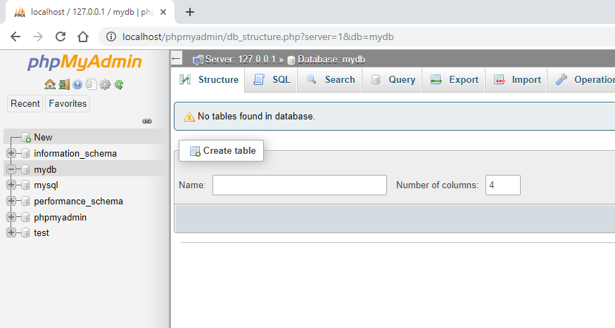
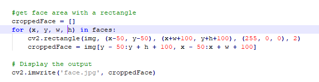
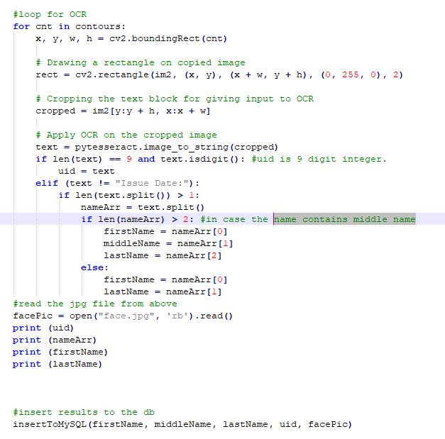
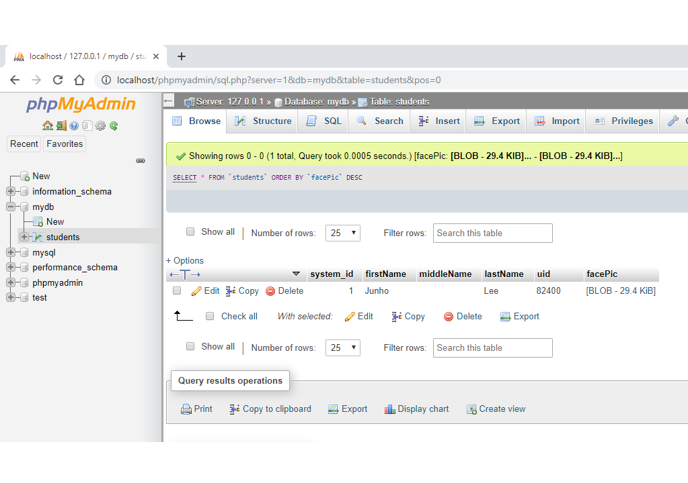
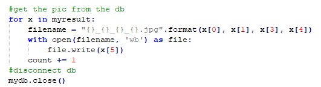

# ID_to_DB_Automation
This program automates the id -> database process. It detects name, id #, face picture from an ID image file and migrates them to a database.

How it works:

 1. Initial status of database (there is nothing!) 

.png)
 2. Get your ID image (i.e., .jpg or .png) and place it into the same folder with .py file here. 

 3. This part detects your face and crop. 

 4. This part detects characters from your ID.  

.png)
 5. Run the code. 

 6. This is the image from #3 code above (it stores in the folder to check). 

 7. Successfully updated the date from ID card image. 
 Let's check if the image file is valid.

 8. Get the image file from the database to double check.  

 9. Looks like the same! 
